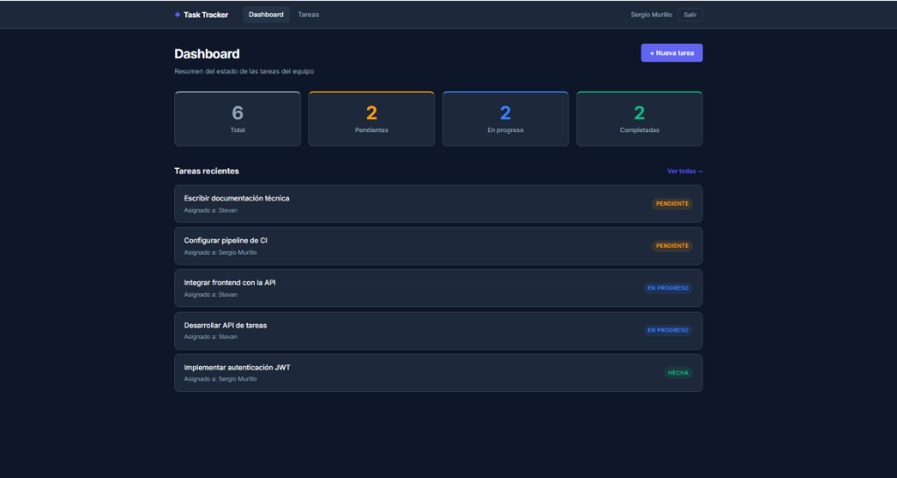
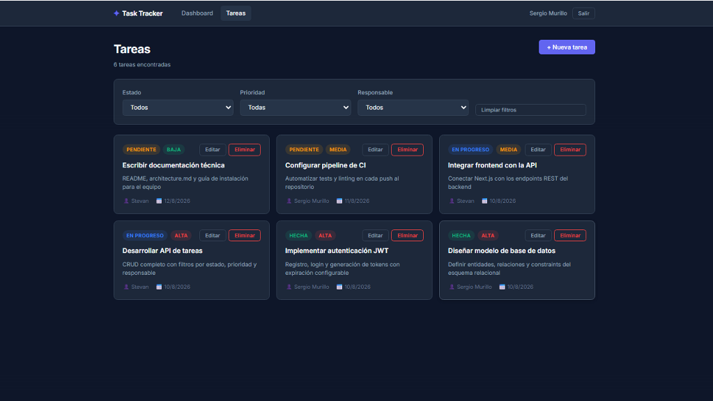
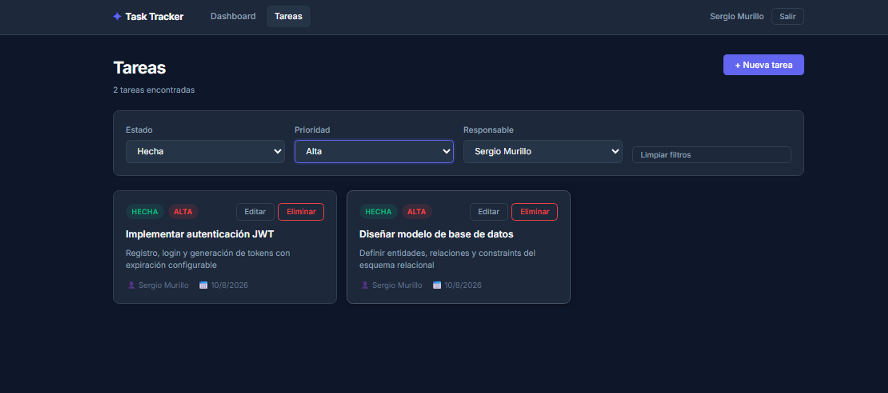
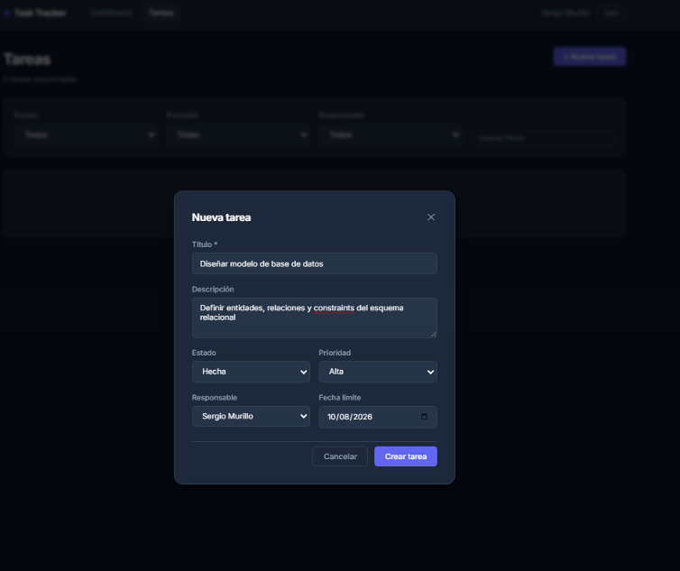

# Task Tracker — Prueba Técnica Fullstack

Sistema de gestión de tareas de equipo con seguimiento de estado, prioridad y responsables. Desarrollado como prueba técnica para la posición de Desarrollador Fullstack en Jiro.

---

## Vista de la aplicación

| Dashboard | Lista de Tareas |
|:---:|:---:|
|  |  |

| Filtros activos | Modal de nueva tarea |
|:---:|:---:|
|  |  |

---

## Stack tecnológico

| Capa | Tecnología | Versión | Justificación |
|:---|:---|:---|:---|
| Frontend | Next.js (App Router) | 16.3.0 | SSR/CSR flexible, routing por carpetas, TypeScript nativo |
| Backend | .NET Web API | 10.0 | Arquitectura por capas, tipado fuerte, rendimiento, madurez del ecosistema |
| Base de datos | SQL Server 2022 | Express (Docker) | Robustez empresarial, compatibilidad nativa con EF Core, fácil containerización |
| ORM | Entity Framework Core | 10.0.10 | Migraciones versionadas, LINQ tipado, abstracción sin perder control |
| Autenticación | JWT (JwtBearer) | — | Stateless, sin sesiones en servidor, estándar para APIs consumidas por SPA |
| Hash de contraseñas | BCrypt.Net-Next | 4.2.0 | Estándar de la industria para auth, resistente a ataques de fuerza bruta |
| Tests | xUnit + Moq + WebApplicationFactory | — | Unit tests sin BD + integration tests sobre el servidor HTTP real |

---

## Funcionalidades implementadas

- **Autenticación:** Registro y login con JWT. Contraseñas hasheadas con BCrypt.
- **Gestión de tareas:** CRUD completo. Cada tarea tiene título, descripción, estado, prioridad, responsable y fecha límite.
- **Filtros dinámicos:** Filtrar tareas por estado (`Pending` / `InProgress` / `Done`), prioridad (`Low` / `Medium` / `High`) y responsable.
- **Dashboard:** Métricas en tiempo real — total de tareas por estado.
- **Seguridad:** Todos los endpoints (excepto `/auth/*`) requieren Bearer token. Acceso sin token → `401 Unauthorized`.

---

## Inicio rápido

### Prerrequisitos
| Herramienta | Versión |
|:---|:---|
| Docker Desktop | 4.x+ |
| .NET SDK | 10.0 |
| Node.js | 20+ |

### 1 — Configurar variables de entorno
```bash
copy .env.example .env
# Editar .env: asignar DB_PASSWORD y JWT_SECRET
```

### 2 — Levantar SQL Server (Docker)
```bash
docker-compose up -d
```

### 3 — Aplicar migraciones y correr el backend
```bash
dotnet ef database update --project backend/src
dotnet run --project backend/src
```
API disponible en → `http://localhost:5000`
Swagger UI → `http://localhost:5000/swagger`

### 4 — Correr el frontend
```bash
cd frontend
npm install
npm run dev
```
App disponible en → `http://localhost:3000`

### 5 — Ejecutar los tests
```bash
# Detener el backend primero (Ctrl+C), luego:
dotnet test backend/tests
```
Resultado esperado: `total: 21; con errores: 0; correcto: 21`

---

## Estructura del repositorio

```
task-tracker/
├── backend/
│   ├── src/              ← Web API (.NET 10)
│   └── tests/            ← Suite de tests (xUnit)
├── frontend/             ← Next.js 16 (App Router)
├── docs/
│   ├── api.md            ← Referencia completa de endpoints
│   ├── architecture.md   ← Diagrama de capas y decisiones
│   ├── setup.md          ← Instalación paso a paso
│   └── decisions/        ← ADRs (Architecture Decision Records)
├── AGENTIC_WORKFLOW.md   ← Documentación del uso de IA en el desarrollo
├── docker-compose.yml
└── .env.example
```

---

## Documentación

| Documento | Descripción |
|:---|:---|
| [Arquitectura del sistema](docs/architecture.md) | Diagrama de capas, modelo de datos, decisiones de diseño |
| [Referencia de la API](docs/api.md) | Todos los endpoints con body, respuestas y ejemplos |
| [Guía de instalación](docs/setup.md) | Prerrequisitos, pasos de instalación y troubleshooting |
| [Workflow con IA](AGENTIC_WORKFLOW.md) | Cómo se usó AntiGravity AI en el desarrollo |
