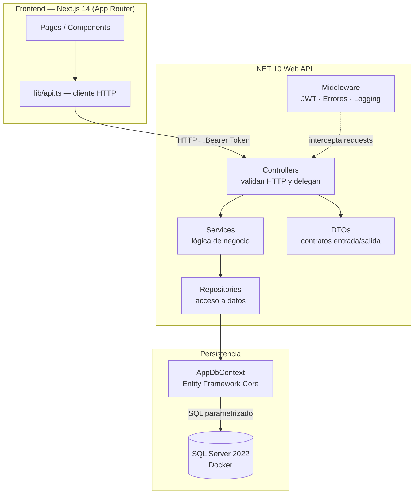
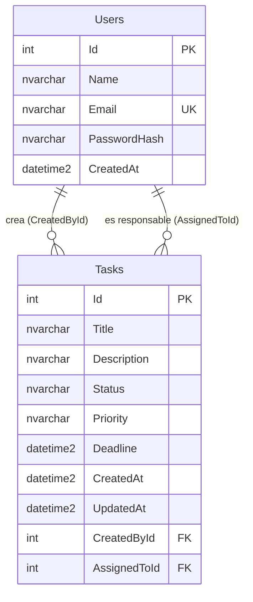

# Arquitectura del Sistema — Task Tracker

## Stack tecnológico

| Capa | Tecnología | Versión |
|:---|:---|:---|
| Frontend | Next.js (App Router) | 14 |
| Backend | .NET Web API | 10.0 |
| ORM | Entity Framework Core | 10.0.10 |
| Base de datos | SQL Server | 2022 (Express, Docker) |
| Autenticación | JWT (JwtBearer) | — |
| Hash de contraseñas | BCrypt.Net-Next | 4.2.0 |
| Documentación API | Swashbuckle / Swagger | 10.2.3 |

---

## Diagrama de capas



---

## Responsabilidad de cada capa

| Capa | Responsabilidad | NO hace |
|:---|:---|:---|
| **Controllers** | Recibe la request HTTP, valida el formato del body (DTO), llama al servicio, devuelve la respuesta HTTP correcta | Contiene lógica de negocio |
| **Services** | Ejecuta la lógica de negocio: validaciones de dominio, reglas, transformaciones | Accede directamente a la BD |
| **Repositories** | Único punto de acceso a la base de datos vía EF Core | Contiene lógica de negocio |
| **DTOs** | Definen el contrato de entrada (`Request`) y salida (`Response`) de la API | Exponen entidades del dominio directamente |
| **Middleware** | Valida JWT en rutas protegidas. Captura excepciones no manejadas y devuelve errores estructurados | — |
| **Models** | Representan las entidades del dominio mapeadas a tablas en SQL Server | — |

---

## Modelo de datos



**Valores de Status:** `Pending` | `InProgress` | `Done`
**Valores de Priority:** `Low` | `Medium` | `High`

---

## Estructura del repositorio

```
task-tracker/
├── backend/
│   └── src/
│       ├── Controllers/        ← endpoints HTTP
│       ├── Services/           ← lógica de negocio
│       ├── Repositories/       ← acceso a datos (EF Core)
│       ├── Models/             ← entidades del dominio
│       │   └── Enums/          ← TaskItemStatus, TaskItemPriority
│       ├── DTOs/               ← contratos de API
│       ├── Data/               ← AppDbContext
│       ├── Middleware/         ← JWT, manejo de errores
│       ├── Migrations/         ← migraciones EF Core (versionadas)
│       └── Program.cs          ← configuración y DI
├── frontend/
│   └── app/                   ← Next.js App Router
├── docs/
│   ├── architecture.md        ← este archivo
│   ├── api.md                 ← referencia de endpoints
│   ├── setup.md               ← instrucciones de instalación
│   └── decisions/             ← ADRs (se publican en la entrega final)
├── AGENTIC_WORKFLOW.md
├── README.md
├── docker-compose.yml
└── .env.example
```

---

## Decisiones de arquitectura relevantes

Ver `docs/decisions/` para los ADRs completos. Resumen:

| Decisión | Elección | Referencia |
|:---|:---|:---|
| Stack tecnológico | Next.js + .NET 10 + SQL Server | ADR-001 |
| Estrategia de auth | JWT stateless | ADR-002 |
| ORM y migraciones | EF Core con migraciones versionadas | ADR-003 |
| Estrategia de testing | xUnit + integración sobre endpoints principales | ADR-004 |
