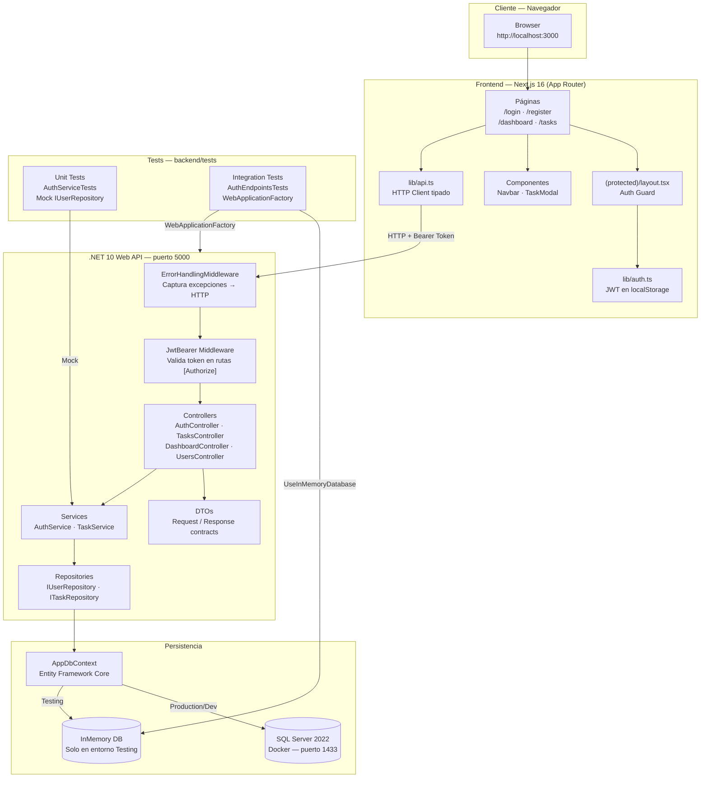
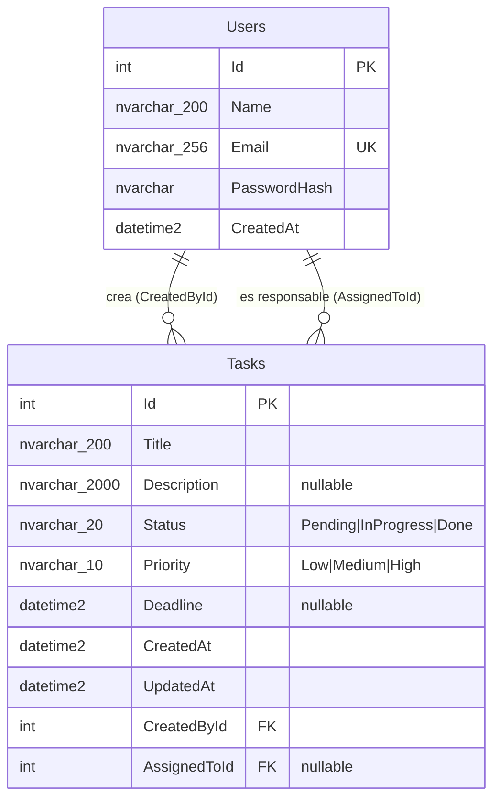

# Arquitectura del Sistema — Task Tracker

## Stack tecnológico

| Capa | Tecnología | Versión |
|:---|:---|:---|
| Frontend | Next.js (App Router) | 16.3.0 |
| Backend | .NET Web API | 10.0 |
| ORM | Entity Framework Core | 10.0.10 |
| Base de datos | SQL Server | 2022 Express (Docker) |
| Autenticación | JWT — `Microsoft.AspNetCore.Authentication.JwtBearer` | 10.0.10 |
| Hash de contraseñas | BCrypt.Net-Next | 4.2.0 |
| Variables de entorno | DotNetEnv | — |
| Documentación API | Swashbuckle / Swagger | 10.2.3 |
| Tests (unit) | xUnit + Moq | 2.9.3 / 4.20.72 |
| Tests (integración) | xUnit + Microsoft.AspNetCore.Mvc.Testing | 10.0.10 |
| BD de tests | Microsoft.EntityFrameworkCore.InMemory | 10.0.10 |

---

## Diagrama de capas



---

## Responsabilidad de cada capa

| Capa | Responsabilidad | NO hace |
|:---|:---|:---|
| **Controllers** | Recibe la request HTTP, valida el body (DTO), llama al servicio, devuelve la response HTTP correcta | Contiene lógica de negocio |
| **Services** | Ejecuta la lógica de negocio: validaciones de dominio, reglas, transformaciones | Accede directamente a la BD |
| **Repositories** | Único punto de acceso a la BD vía EF Core | Contiene lógica de negocio |
| **DTOs** | Definen el contrato de entrada (`Request`) y salida (`Response`) de la API | Exponen entidades del dominio directamente |
| **ErrorHandlingMiddleware** | Captura excepciones del dominio y las convierte en respuestas HTTP estructuradas | — |
| **JwtBearer Middleware** | Valida el token en rutas con `[Authorize]`. Si inválido → `401` automático | — |
| **Models** | Entidades del dominio mapeadas a tablas en SQL Server | — |

> **Nota de implementación:** `UsersController` es una excepción a la arquitectura por capas: inyecta `IUserRepository` directamente (sin pasar por una capa de servicio), ya que el listado de usuarios no requiere lógica de negocio adicional — es una consulta de lectura simple.

---

## Manejo de errores — ErrorHandlingMiddleware

El middleware intercepta toda la pipeline y convierte excepciones del dominio en respuestas HTTP semánticas:

| Excepción C# | HTTP | Escenario |
|:---|:---:|:---|
| `InvalidOperationException` | `409 Conflict` | Violación de regla de negocio (ej: email duplicado) |
| `UnauthorizedAccessException` | `401 Unauthorized` | Credenciales inválidas en login |
| `KeyNotFoundException` | `404 Not Found` | Recurso no encontrado — lanzado por `UpdateAsync` y `DeleteAsync` |
| `Exception` (cualquier otra) | `500 Internal Server Error` | Error inesperado — mensaje genérico, sin detalles internos |

> **Nota:** `GET /api/tasks/{id}` retorna `404` directamente desde el controller (`return NotFound(...)`) — no via excepción. Solo `PUT` y `DELETE` pasan por el middleware para el 404.

**Formato de respuesta de error (siempre consistente):**
```json
{ "message": "Descripción del error" }
```

---

## Autenticación JWT

### Flujo completo
```
1. POST /api/auth/login → AuthService valida credenciales con BCrypt
2. Si válidas → GenerateJwt() crea un token firmado con HMAC-SHA256
3. El token se devuelve al cliente en AuthResponse.Token
4. El frontend guarda el token en localStorage (lib/auth.ts)
5. En cada request posterior → lib/api.ts agrega: Authorization: Bearer <token>
6. JwtBearer middleware valida la firma y la expiración automáticamente
7. Si válido → el controlador ejecuta. Si inválido → 401 automático.
```

### Claims incluidos en el token

| Claim | Tipo | Valor |
|:---|:---|:---|
| `NameIdentifier` | `ClaimTypes.NameIdentifier` | `user.Id.ToString()` |
| `Email` | `ClaimTypes.Email` | Email normalizado (lowercase) |
| `Name` | `ClaimTypes.Name` | Nombre del usuario |

### Seguridad implementada

- **BCrypt**: Contraseñas hasheadas con salt aleatorio. Nunca se guarda texto plano.
- **Timing-safe login**: Si el email no existe O la contraseña es incorrecta, se lanza la misma excepción (`"Credenciales inválidas"`). Esto previene *user enumeration attacks*.
- **Email normalizado**: `ToLowerInvariant()` al registrar y al buscar. Evita duplicados por capitalización.
- **JWT_SECRET**: Leído del `.env`, nunca hardcodeado. Mínimo recomendado: 32 caracteres.

---

## Modelo de datos



**Notas de implementación:**
- `Status` y `Priority` se almacenan como `nvarchar` (no como enteros) — ver ADR-003
- `AssignedToId` es nullable: una tarea puede no tener responsable asignado
- `Description` y `Deadline` son opcionales
- `UpdatedAt` se actualiza automáticamente en cada `PUT`

---

## Componentes del frontend

### Páginas

| Ruta | Archivo | Acceso | Descripción |
|:---|:---|:---:|:---|
| `/login` | `app/login/page.tsx` | Público | Formulario de login. Redirige a `/dashboard` si ya hay token |
| `/register` | `app/register/page.tsx` | Público | Formulario de registro |
| `/dashboard` | `app/(protected)/dashboard/page.tsx` | 🔒 Auth | 4 métricas de estado + 5 tareas recientes |
| `/tasks` | `app/(protected)/tasks/page.tsx` | 🔒 Auth | CRUD completo + filtros por estado/prioridad/responsable |

### Componentes compartidos

| Componente | Archivo | Responsabilidad |
|:---|:---|:---|
| `Navbar` | `components/Navbar.tsx` | Navegación principal, active state, botón de logout |
| `TaskModal` | `components/TaskModal.tsx` | Modal de creación/edición de tareas. Cierre con `Escape` |
| Auth Guard | `app/(protected)/layout.tsx` | Verifica token en `useEffect`. Si no hay → redirige a `/login` |

### Utilidades

| Archivo | Responsabilidad |
|:---|:---|
| `lib/api.ts` | Cliente HTTP tipado. Inyecta `Authorization: Bearer` automáticamente en cada request |
| `lib/auth.ts` | Lee/escribe el token y los datos del usuario en `localStorage` |
| `types/index.ts` | Tipos TypeScript alineados con los DTOs del backend (`TaskItem`, `User`, `AuthResponse`, etc.) |

### Sistema de diseño

| Archivo | Descripción |
|:---|:---|
| `app/globals.css` | Tokens CSS globales: `--primary`, `--bg-base`, `--bg-surface`, `--text-muted`, etc. Dark mode por defecto. Tipografía Inter (Google Fonts) |
| `*.module.css` | Estilos encapsulados por componente/página. Sin colisiones de clases |

---

## Configuración por entorno

| Variable | Desarrollo | Testing | Producción |
|:---|:---|:---|:---|
| Base de datos | SQL Server (Docker) | InMemory (sin Docker) | SQL Server |
| `ASPNETCORE_ENVIRONMENT` | `Development` | `Testing` | `Production` |
| Swagger UI | ✅ Activo (`IsDevelopment()`) | ❌ Desactivado | ❌ Desactivado |
| `JWT_SECRET` | Valor del `.env` | Hardcodeado en `TestWebApplicationFactory` | Variable de entorno del servidor |

**Detección de entorno en `Program.cs`:**
```csharp
if (builder.Environment.IsEnvironment("Testing"))
    services.AddDbContext<AppDbContext>(o => o.UseInMemoryDatabase("TestDb"));
else
    services.AddDbContext<AppDbContext>(o => o.UseSqlServer(connectionString));
```

---

## Estructura completa del repositorio

```
task-tracker/
├── backend/
│   ├── src/                          ← Proyecto principal (TaskTracker.Api)
│   │   ├── Controllers/
│   │   │   ├── AuthController.cs     ← POST /register, POST /login
│   │   │   ├── TasksController.cs    ← CRUD /tasks + filtros dinámicos
│   │   │   ├── DashboardController.cs← GET /dashboard (métricas)
│   │   │   └── UsersController.cs    ← GET /users (listado para asignar)
│   │   ├── Services/
│   │   │   ├── AuthService.cs        ← Lógica de registro, login, JWT
│   │   │   ├── IAuthService.cs
│   │   │   ├── TaskService.cs        ← CRUD de tareas, filtros, validaciones
│   │   │   └── ITaskService.cs
│   │   ├── Repositories/
│   │   │   ├── UserRepository.cs     ← Acceso a Users via EF Core
│   │   │   ├── IUserRepository.cs
│   │   │   ├── TaskRepository.cs     ← Acceso a Tasks via EF Core
│   │   │   └── ITaskRepository.cs
│   │   ├── Models/
│   │   │   ├── User.cs
│   │   │   ├── TaskItem.cs           ← Nombrado TaskItem (evita conflicto con System.Threading.Tasks.Task)
│   │   │   └── Enums/
│   │   │       ├── TaskItemStatus.cs ← Pending | InProgress | Done
│   │   │       └── TaskItemPriority.cs← Low | Medium | High
│   │   ├── DTOs/
│   │   │   ├── Auth/                 ← LoginRequest, RegisterRequest, AuthResponse
│   │   │   └── Tasks/                ← CreateTaskRequest, UpdateTaskRequest, TaskResponse
│   │   ├── Data/
│   │   │   └── AppDbContext.cs       ← DbSets + OnModelCreating (relaciones, conversiones enum→string)
│   │   ├── Middleware/
│   │   │   └── ErrorHandlingMiddleware.cs ← Captura excepciones → HTTP codes
│   │   ├── Migrations/               ← Migraciones EF Core versionadas (InitialCreate)
│   │   └── Program.cs                ← DI, JWT, CORS, middleware pipeline
│   └── tests/                        ← Proyecto de tests (TaskTracker.Tests)
│       ├── Unit/
│       │   └── AuthServiceTests.cs   ← 6 unit tests con Moq<IUserRepository>
│       └── Integration/
│           └── AuthEndpointsTests.cs ← 4 integration tests con WebApplicationFactory
├── frontend/                         ← Proyecto Next.js 16
│   ├── app/
│   │   ├── globals.css               ← Sistema de diseño (tokens CSS, dark mode)
│   │   ├── layout.tsx                ← Root layout con metadatos SEO
│   │   ├── page.tsx                  ← Redirect → /dashboard o /login
│   │   ├── (protected)/
│   │   │   ├── layout.tsx            ← Auth guard
│   │   │   ├── dashboard/page.tsx    ← Métricas + tareas recientes
│   │   │   └── tasks/page.tsx        ← CRUD + filtros
│   │   ├── login/page.tsx
│   │   └── register/page.tsx
│   ├── components/
│   │   ├── Navbar.tsx                ← Navegación + logout
│   │   └── TaskModal.tsx             ← Modal crear/editar
│   ├── lib/
│   │   ├── api.ts                    ← HTTP client tipado (fetch + Bearer token)
│   │   └── auth.ts                   ← Gestión de token en localStorage
│   └── types/index.ts                ← Tipos TypeScript (TaskItem, User, AuthResponse, etc.)
├── docs/
│   ├── architecture.md               ← Este documento
│   ├── api.md                        ← Referencia completa de endpoints
│   ├── setup.md                      ← Instalación paso a paso
│   └── decisions/                    ← ADRs
│       ├── 001-stack.md
│       ├── 002-auth.md
│       ├── 003-database.md
│       ├── 004-testing.md
│       └── 005-frontend.md
├── AGENTIC_WORKFLOW.md               ← Decisiones tomadas con asistencia de IA
├── README.md
├── docker-compose.yml
└── .env.example
```

---

## Decisiones de arquitectura

| Decisión | Elección | Justificación resumida |
|:---|:---|:---|
| Stack tecnológico | Next.js 16 + .NET 10 + SQL Server | Madurez del ecosistema, tipado fuerte, migraciones versionadas |
| Estrategia de auth | JWT stateless + BCrypt | Sin sesiones en servidor, estándar de la industria |
| ORM y migraciones | EF Core con migraciones versionadas | Control de versiones del esquema, LINQ tipado |
| Estrategia de testing | xUnit + Moq + WebApplicationFactory | Unit tests sin BD + integration tests sobre el servidor real |
| Arquitectura del frontend | App Router + CSS Modules + localStorage | SSR/CSR flexible, estilos encapsulados por componente |
