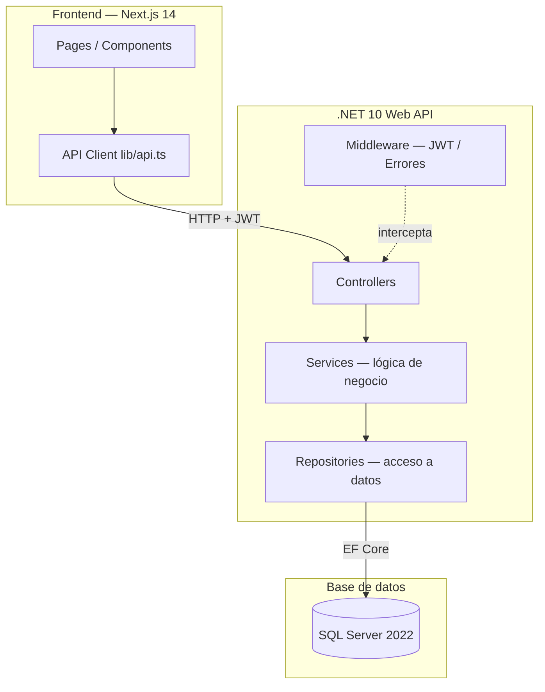

# Arquitectura del Sistema

> Documento en construcción — se completa al finalizar el desarrollo.

## Diagrama de capas

## Descripción de capas

| Capa | Responsabilidad |
|:---|:---|
| **Controllers** | Recibe la request HTTP, valida el formato de entrada, delega al servicio |
| **Services** | Contiene la lógica de negocio. No conoce HTTP ni la BD directamente |
| **Repositories** | Único punto de acceso a la base de datos vía EF Core |
| **Middleware** | Validación de JWT en rutas protegidas. Manejo centralizado de errores |
| **DTOs** | Contratos de entrada/salida de la API — desacoplan el modelo de la respuesta HTTP |
